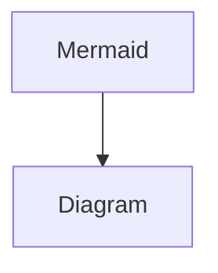

# Page 1

$$f(x) = x * e^{2 pi i \xi x}$$ is a good formula I wish it used $this$ syntax


```bash
test this code
```


[HR private](https://app.gitbook.com/o/ffqOArguYj9F5RLpVgmf/s/1cMDAADiXGvQgDwIymlw/)


<figure><figcaption></figcaption></figure>

***


|      |        |      |
| ---- | ------ | ---- |
| some | stuff  | here |
|      |        |      |
|      |        |      |

{% @linear/embed url="https://linear.app/richfox/issue/RIC-1/welcome-to-linear-%F0%9F%91%8B" issueId="RIC-1" %}


this $$\sqrt{3}$$



